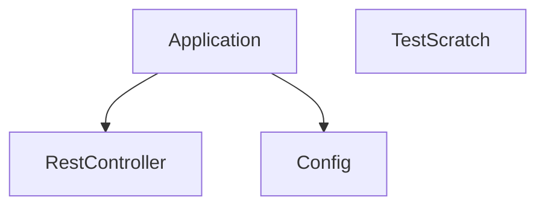

## 1. Stack
- Java 17 (`java.version` in pom.xml)
- Spring Boot 4.0.5 (`spring-boot-starter-parent`), Maven (mvnw wrapper)
- Dependencies: `spring-boot-starter-webmvc`, `spring-boot-starter-webmvc-test` (test scope)
- Plugin: `spring-boot-maven-plugin`
- `Test/` folder: plain Java, no framework, no build file (IntelliJ module only)

## 2. Directory map
| path | what lives there |
|---|---|
| `My First Spring Boot Project/` | Maven Spring Boot app root (pom.xml, mvnw, mvnw.cmd) |
| `My First Spring Boot Project/src/main/java/com/example/myfirstspringbootproject/` | Application entry point + REST controller |
| `My First Spring Boot Project/src/main/resources/` | `application.properties` (Spring config) |
| `My First Spring Boot Project/src/test/java/com/example/myfirstspringbootproject/` | Spring Boot test class |
| `Test/` | Standalone plain-Java scratch project (IntelliJ module, unrelated to Spring app) |
| `Test/src/` | `Main.java` (plain Java entry point) |

## 3. Diagram

## 4. Component index
- [[Application]]
- [[RestController]]
- [[Config]]
- [[TestScratch]]

## 5. Entry points
- Dev (Spring app): `./mvnw spring-boot:run` in `My First Spring Boot Project/` (goal provided by `spring-boot-maven-plugin` in pom.xml)
- Prod (Spring app): `./mvnw clean package` then `java -jar target/*.jar` (repackage goal from `spring-boot-maven-plugin`)
- Main class: `My First Spring Boot Project/src/main/java/com/example/myfirstspringbootproject/MyFirstSpringBootProjectApplication.java`
- Standalone scratch: `Test/src/Main.java` — plain `public static void main`, compiled/run independently (no pom.xml/build file present)

## 6. Conventions
- Package name: `com.example.myfirstspringbootproject` (single lowercase word, Spring Initializr default)
- Controllers annotated `@RestController`; endpoint methods annotated `@GetMapping(...)` (observed in `MyClass.java`, path given as `"Hello"` without a leading slash)
- Bootstrap class annotated `@SpringBootApplication`, named `<ProjectName>Application` (`MyFirstSpringBootProjectApplication.java`)
- Build via the committed Maven wrapper (`mvnw`/`mvnw.cmd`), not a bare `mvn`
- `Test/` has no package declaration in `Main.java` and no build descriptor — isolated from the Maven project's conventions

## 7. Where things go
- New REST endpoint: add a method (or new `@RestController` class) in `My First Spring Boot Project/src/main/java/com/example/myfirstspringbootproject/`
- New config property: `My First Spring Boot Project/src/main/resources/application.properties`
- New dependency: `My First Spring Boot Project/pom.xml` under `<dependencies>`
- New test: `My First Spring Boot Project/src/test/java/com/example/myfirstspringbootproject/`
- Changes to the unrelated scratch project: `Test/src/Main.java` only — do not wire it into the Maven build
